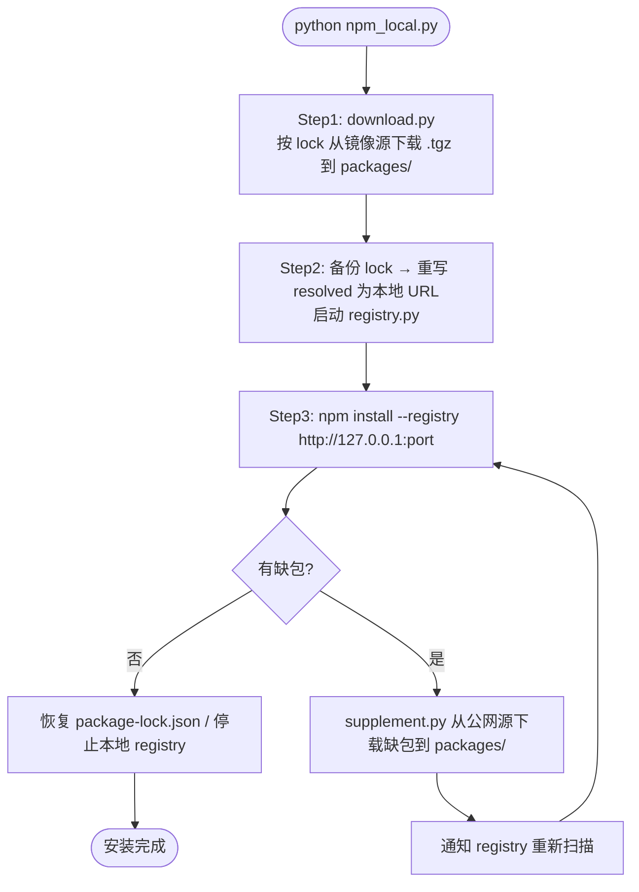

# npm 依赖本地闭环工具

按 `package-lock.json` 下载依赖到 `packages/` → 本地 registry 提供包 → `npm install` 从本地安装，缺包自动从公网补充并重试，全程不依赖私有仓库。

> 已在 **Python 3.13** + **npm 10** 环境下测试通过。

## 目录结构

```
project-root/
├── package.json
├── package-lock.json
├── npm_local.py            ← 入口脚本
├── _tools/                 ← 工具脚本目录
│   ├── config.py           ← 配置 + 平台初始化
│   ├── flow.py             ← 主流程
│   ├── download.py         ← 阶段一：按 lock 下载
│   ├── supplement.py       ← 阶段二：补缺包
│   ├── registry.py         ← 本地 HTTP registry
│   ├── publish.py          ← 独立工具：上传到 Nexus
│   └── requirements.txt    ← Python 依赖
├── packages/               ← 运行后生成（.tgz 文件）
├── logs/                   ← 运行后生成
└── node_modules/           ← 运行后生成
```

## 快速开始

1. **安装 Python 依赖**

   ```bash
   pip install -r _tools/requirements.txt
   ```

2. **放入依赖清单**

   将项目的 `package.json` 和 `package-lock.json` 放到项目根目录（与 `npm_local.py` 同级）。

3. **配置**

   编辑 `_tools/config.py` 顶部的项目配置区：

   | 项 | 说明 | 默认值 |
   |----|------|--------|
   | `SKIP_PHASE1` | 跳过下载阶段（`0`=不跳，`1`=跳过） | `0` |
   | `LOCAL_REGISTRY_PORT` | 本地 registry 端口 | `4874` |
   | `DOWNLOAD_REGISTRY` | 阶段一下载镜像（加速源） | `https://registry.npmmirror.com` |
   | `NPM_PUBLIC_REGISTRY` | 阶段二补包公网源 | `https://registry.npmjs.org` |
   | `DOWNLOAD_TIMEOUT` | 下载超时（秒） | `30` |
   | `DOWNLOAD_CONCURRENCY` | 并发下载数 | `10` |

4. **执行**

   ```bash
   python npm_local.py
   ```

## 执行流程



## 日志

输出到 `logs/` 目录：

| 文件 | 内容 |
|------|------|
| `download.log` | 阶段一下载失败记录 |
| `npm_install.log` | npm install 输出 |
| `supplement_round.log` | 每轮补包列表 |
| `supplement_total.log` | 本次运行补包汇总 |

## 部署到实际项目

将以下文件拷贝到目标项目根目录（与 `package.json` 同级）：

```
npm_local.py
_tools/
```

然后在目标项目中执行：

```bash
pip install -r _tools/requirements.txt
python npm_local.py
```

## 单独使用

**只下载**

```bash
python _tools/download.py
```

**只启动本地 registry**

```bash
python _tools/registry.py 4874
```

再执行：

```bash
npm install --registry http://127.0.0.1:4874
```

## 环境要求

- Python >= 3.10（已在 3.13 上测试），`pip install -r _tools/requirements.txt`
- npm（阶段二需要）
